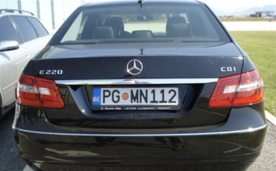
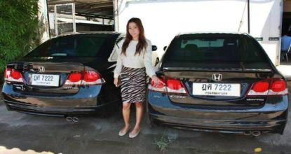
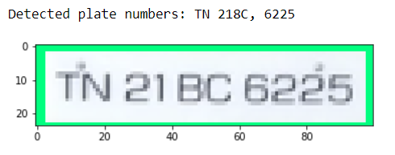

# ANPR

## Automatic number plate recognizer

The purpose of the project was to create a system that is able to detect licence plates from the image and detect their numbers. [Current state of the model.](ckpt-6.index)

### Model and dataset
We used [tensorflow pre-trained model](https://github.com/tensorflow/models) that can be downloaded [here.](http://download.tensorflow.org/models/object_detection/tf2/20200711/ssd_mobilenet_v2_fpnlite_320x320_coco17_tpu-8.tar.gz)
This model was trained on [COCO 2017 dataset](https://www.kaggle.com/datasets/awsaf49/coco-2017-dataset) with training images scaled to 320x320. 
Our model was fully trained on the [Car Licence Plate Detection dataset](https://www.kaggle.com/datasets/andrewmvd/car-plate-detection?resource=download) from Kaggle.  
This dataset contains 443 images with bounding box annotations of the car license plates within the image. The collection includes images of cars with visible number plates. The images are taken from a variety of perspectives, most with one visible vehicle, but there are also examples with more objects. 
The dataset includes number plates from various countries, as well as custom ones.  
Example input images:  
|   |  |  |
| ------------- | ------------- | ------------- |

The output is an image with found boundaries (considering a certain threshold of model confidence) of the licence plate:  

  

  
### Recognizing numbers
Firstly we preprocessed images with detected licences manually using the OpenCV library and a model for characters detection that was used in our other project but the results were unsatisfying. 
That's why we switched to [EasyOCR library](https://github.com/JaidedAI/EasyOCR) which outperformed our previous solution.  

  

 
Due to the lack of information on registration numbers, automatic tests of the results are not possible. However, we decided to perform manual tests in three categories:  

- Plate detection
- Recognition of the entire licence plate
- Average number of correctly recognised characters (the average ratio of the correct characters in the correct positions to the total number of characters)

After manual testing on 40 test images, we obtained the following results:

| | Correct plate detection  | Correct plate recognition |
| :---  | :---:  | :---:  |
| Accuracy | 87.5 % | 32.5 % |

 

| | Correctly recognised characters |
| :---  | :---:  |
| Average | 48.9 % |
| Median | 72.5 % |

 
As you can see, the model performs quite well in licence plate detection, even in difficult cases. 
The value of correctly recognised plates is low, as already one incorrect mark indicated an incorrectly recognised plate. 
To get a better idea of the model's performance, you can look at the table with the ratio of correctly recognised characters to all characters on a given number plate. The results look quite good. 
There were situations where the model correctly read the writing on the plate, but it was not the registration number (e.g. the name of the state). A solution to this problem could be to increase the restrictions in the OCR. There were also examples in the test set that were impossible to recognise even by a human. 

### Further work
Further works are related to the Master thesis and will be based on comparing different methods of licence plate detection and recognition. The objective is to create a system capable of processing video.  
