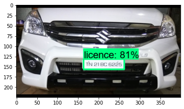

# ANPR

## Automatic number plate recognizer

The purpose of the project was to create a system that is able to detect registration plate from the image and detect its numbers. 

#### Model
We used [tensorflow pre-trained model](https://github.com/tensorflow/models) that can be downloaded [here.](http://download.tensorflow.org/models/object_detection/tf2/20200711/ssd_mobilenet_v2_fpnlite_320x320_coco17_tpu-8.tar.gz)
This model was trained on [COCO 2017 dataset](https://www.kaggle.com/datasets/awsaf49/coco-2017-dataset) with training images scaled to 320x320. 
Our model was fully trained on the [Car Licence Plate Detection dataset](https://www.kaggle.com/datasets/andrewmvd/car-plate-detection?resource=download) from Kaggle. 

The output is an image with found boundaries (considering certain threshold of model confidence) of the licence plate:  

  

  
#### Recognizing numbers
Firsly we preprocessed images with detected licences manually with openCV library and then used model for characters detection that was used in other project but results were unsatysfying. 
That's why we switched to [EasyOCR library](https://github.com/JaidedAI/EasyOCR) that outperformed our previous solution. 
